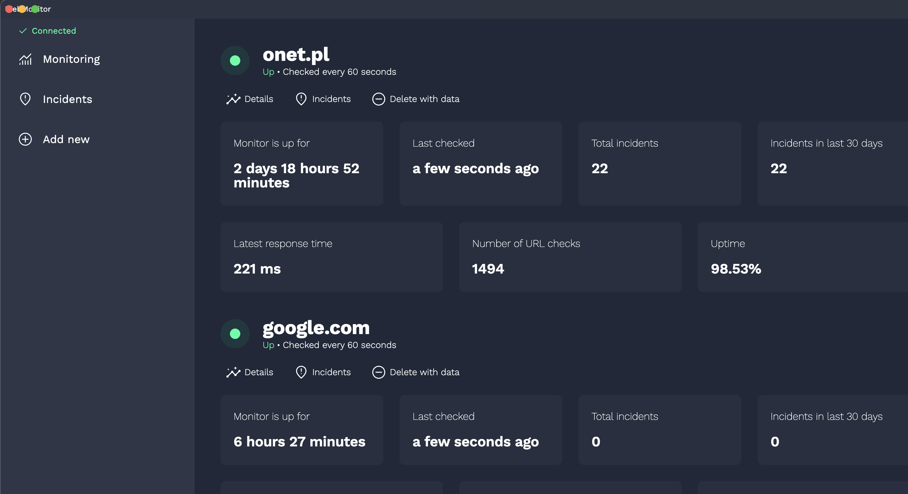
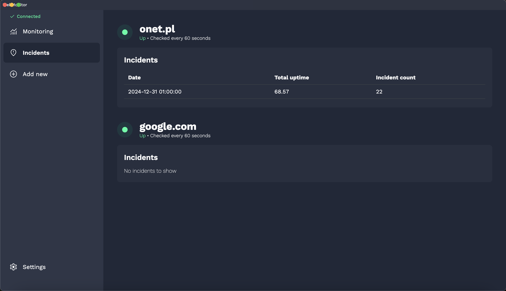
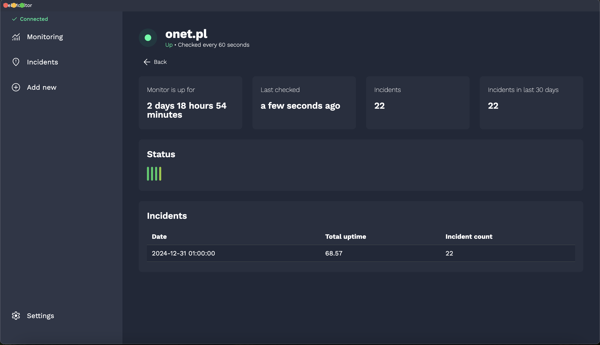
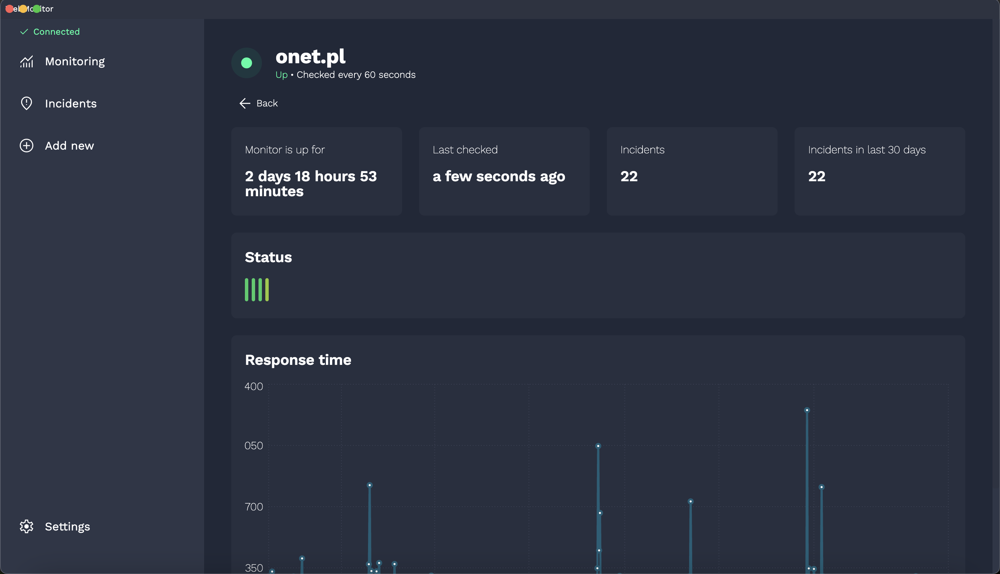

# WebMonitoring Service

WebMonitor is a comprehensive solution for monitoring the health of webpages. It allows users to:

- Add and monitor multiple URLs.
- Get email notifications when a webpage goes down.
- View detailed analytics such as total hits, uptime, and more via a dashboard.

Built using:

- **Frontend:** React with Electron.
- **Backend:** Node.js with Express and MongoDB.

## Features

- Monitor multiple URLs for uptime/downtime.
- Real-time notifications via email.
- Dashboard displaying key metrics like uptime, hits, and response times.
- Cross-platform desktop app using Electron.

## Screenshots






## Installation and Setup

### Prerequisites

- Node.js (>=14.x)
- npm or yarn
- MongoDB

### Cloning the Repository

```bash
git clone https://github.com/mattkawczynski/webmonitor.git
cd webmonitor
```

### Backend Setup

1. Navigate to the backend directory:

   ```bash
   cd server
   ```

2. Install dependencies:

   ```bash
   npm install
   ```

3. Create a `.env` file in the `server` directory with the following variables:

   ```env
   NODE_ENV=development
   PORT=1337
   DATABASE_URL=mongodb://127.0.0.1/monitoring
   DATABASE_USER=
   DATABASE_PASSWORD=
   CORS_ORIGIN=http://localhost:8080
   SENGRID_API_KEY=SG.YOUR_SENDGRID_API_KEY
   AUTH_TOKEN=Generated auth token
   EMAIL_RECIPIENTS=email1@example.com, email2@example.com
   EMAIL_FROM_ADDRESS=email1@example.com
   USE_SENDGRID=false
   EMAIL_HOST=
   EMAIL_PORT=587
   EMAIL_USER=
   EMAIL_PASS=
   ```

4. Start the server:

   ```bash
   npm run dev
   ```

   The backend should now be running at `http://localhost:1337`.

### Frontend Setup

1. Navigate to the frontend directory:

   ```bash
   cd client
   ```

2. Install dependencies:

   ```bash
   npm install
   ```

3. Bundle the Electron app for development:

   ```bash
   npm run package
   ```

4. Launch the app. Upon first launch, navigate to the **Settings** page within the app to configure your credentials:
   - Enter the **API Endpoint** (e.g., `http://localhost:1337`).
   - Provide the **Authorization Token** to enable communication with the backend.

## Communication Between Frontend and Backend

- The frontend communicates with the backend using a WebSocket connection.
- Authentication is managed using an `AUTH_TOKEN`. Users need to generate this token and configure it in the **Settings** page of the app.

## Deployment

### Building the App

1. To package the Electron app for production, run:

   ```bash
   npm run package
   ```

2. The built application will be located in the `builds` directory.

## Contributing

Feel free to open issues or submit pull requests for new features or bug fixes.

## To-Do List

1. Optimize the number of WebSocket connections.
2. Improve graph rendering performance for the dashboard.
3. Enhance error handling and validation for user inputs in the Settings page.
4. Implement testing for critical components to improve reliability.
5. Add support for custom notification methods (e.g., Slack, SMS, Discord).
6. Improve the onboarding process for first-time users.

## License

This project is licensed under the MIT License. See the LICENSE file for details.

